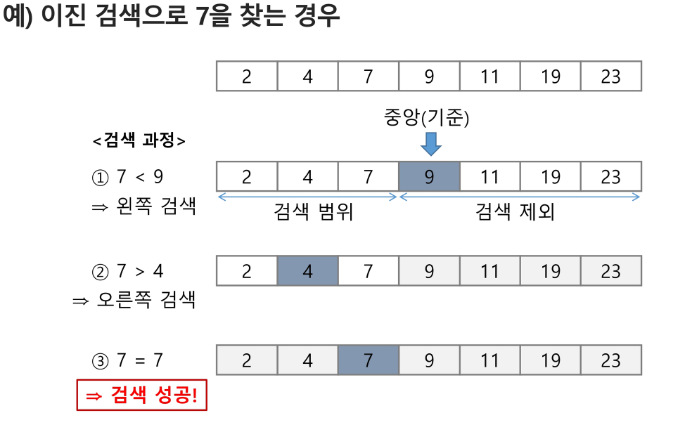

# 검색
* 저장되어 있는 자료 중에서 원하는 항목을 찾는 작업
* 목적하는 탐색 키를 가진 항목을 찾는 것
    * 탐색 키 : 자료를 구별하여 인식할 수 있는 키
* 검색의 종류
    * 순차검색
    * 이진 검색 # 가장많이 검색하는 방법
    * 해쉬
## 순차 검색
* 일렬로 되어 있는 자료를 순서대로 검색하는 방법
    * 가장 간단하고 직관적인 검색 방법
    * 배열이나 연결 리스트 등 순차구조로 구현된 자료 구조에서 원하는 항목을 찾을 때 유용함
    * 알고리즘이 단순하여 구현이 쉽지만, 검색 대상의 수가 많은 경우에는 수행시간이 급격히 증가하여 비효율적임
* 2가지 경우가 있음
    * 정렬된 경우
    * 정렬이 안된 경우

### 정렬이 안된 경우 
* 검색 과정
    * 첫 번째 원소부터 순서대로 검색 대상과 키값이 같은 원소가 있는지 비교하며 찾는다.
    * 키 값이 동일한 원소를 찾으면 그 원소의 인덱스를 반환한다.
    * 자료구조의 마지막에 이를 때까지 검색 대상을 찾지 못하면 검색 실패
* 찾고자 하는 원소의 순서에 따라 비교회수가 결정됨
    * 첫 번째 원소를 찾을 때는 1번 비교, 두번째 원소를 찾을 때는 2번 비교
    * 정렬되지 않은 자료에서의 순차 검색의 평균 비교 회수
        * =(1/n)*(1+2+3+...+n) =(n+1)/2
    * 시간복잡도: O(n)
    못찾을 경우 n회 모두 검색
    구현 예시
    ```py
    def sequential_search(a,n,key)
        i <- 0
        while i<n and a[i]!=key: # while문이 앞에 있어야 n이 넘어가도 뒷 연산을 진행하지 않으므로 앞에 위치
            i <- i+1
        if i <n : return i
        else : return -1
    ```

### 정렬이 되어 있는 경우
* 검색 과정
    * 자료가 오름차순으로 정렬된 상태에서 검색을 실시한다고 가정할 경우
    * 자료를 순차적으로 검색하면서 키 값을 비교하여, 원소의 키값이 검색 대상의 키값보다 크면 찾는 원소가 없다는 것이므로 더이상 검색하지 않고 검색 종료  = 찾을 대상이 있으나 없으나 평균n/2회로 검색
* 찾고자 하는 원소의 순서에 따라 비교회수가 결정됨
    * 정렬이 되어있으므로, 검색 실패를 반환하는 경우 평균 비교회수가 반으로 줄어든다.
    * 시간 복잡도 : O(n)
      ```py
        def sequential_search(a,n,key)
            i <- 0
            while i<n and a[i]!=key: 
                i <- i+1
            if i <n and a[i]==key: 
                return i
            else :
                return -1
    ```

## 이진 검색
* 자료의 가운데에 있는 항목의 키 값과 비교하여 다음 검색의 위치를 결정하고 검색을 계속 진행하는 방법
    * 목적 키를 찾을 때까지 이진 검색을 순환적으로 반복 수행함으로써 검색 범위를 반으로 줄여가면서 보다 빠르게 검색을 수행함.
* 이진 검색을 하기 위해서는 자료가 정렬된 상태여야 함.
* 검색과정
    1. 자료의 중앙에 있는 원소를 고른다. (인덱스중 중앙값=N//2)
    2. 중앙 원소의 값과 찾고자 하는 목표값을 비교한다.
    3. 목표 값이 중앙 원소의 값보다 작으면 자료의 왼쪽 반에 대해서 새로 검색을 수행하고, 크다면 자료의 오른쪽 반에 대해서 새로 검색을 수행한다.
    4. 찾고자 하는 값을 찾을 때까지 1~3의 과정을 반복한다.



### 구현
* 검색 범위의 시작점과 종료점을 이용하여 검색을 반복 수행한다.
* 이진 검색의 경우, 자료에 삽입이나 삭제가 발생했을 때 배열의 상태를 항상 정렬 상태로 유지하는 추가 작업이 필요하다.

```py
def binarySearch(a,N,key)
    start = 0
    end = N-1
    while start <= end:
        middle = (start +end)//2 #가운데 인덱스 찾고
        if a[middle] == key: # 검색 성공하면 반환
            return true
        elif a[middle] > key:
            end = middle -1
        else:
            start =middle +1
    return false # 검색 실패
```
* 재귀함수를 이용하여 이진검색 알고리즘을 짤수 있음
```py
def binary search2(a, low, high, key):
    if low > high: # 검색 실패
        return False
    else:
        middle = (low+ high)//2
        if key == a[middle]: # 검색 성공
            return True
        elif key < a[middle]:
            return binarySearch2(a,low,middle-1,key)
        elif a[middle]<key:
            return binarySearch2(a,middle+1,high,key)

```
# 인덱스
* 인덱스라는 요어는 Database에서 유래했으며, 테이블에 대한 동작 속도를 높여주는 자료 구조를 일컫는다. Database 분야가 아닌 곳에서는 Look up table등의 용어를 사용하기도 한다.
* 인덱스를 저장하는 데 필요한 디스크 공간은 보통 테이블을 저장하는데 필요한 디스크 공간보다 작다. 왜냐하면 보통 인덱스는 키-필드만 갖고 있고, 테이블의 다른 세부 항목들을 갖고 있지 않기 때문
* 배열을 사용한 인덱스
    * 대량의 데이터를 매번 정렬하면, 프로그램의 반응은 느려질 수 밖에 없다. 이러한 대량 데이터의 성능 저하 문제를 해결하기 위해 배열 인덱스를 사용할 수 있음
    * 원본데이터에 데이터가 삽입될 경우 상대적으로 크기가 작은 인덱스배열을 정렬하기 때문에 속도가 빠르다.(문자열보다 숫자가 더 검색이 빠름)

## 선택 정렬
* 주어진 자료들 중 가장 작은 값의 원소부터 차례대로 선택하여 위치를 교환하는 방식
    * 앞서 살펴본 셀렉션 알고리즘을 전체 자료에 적용한 것이다.
* 정렬과정
    * 주어진 리스트 중에서 최소값을 찾는다.
    * 그 값을 리스트의 맨앞에 위치한 값과 교환한다.
    * 맨 처음 위치를 제외한 나머지 리스트를 대상으로 위의 과정을 반복한다.
* 시간 복잡도
    * O(n2)
* 선택정렬 알고리즘
```py
    def SelectionSort(a,N)
    # 구가의 시작이 i
        for i in range(N-1):
            minIdx = i # 구간의 최솟값 위치 min_idx, 첫 원소를 최소 원소로 가정
            for j in range(i+i,N): # 실제 최솟값을 찾을 위치 j
                if a[minIdx]>a[j]:
                    minIdx = j
            a[i], a[minIdx] = a[minIdx], a[i]
    return      # 리턴값이 없으면 자동으로 반환을 안함 but 형식적으로 종료했다고 선언
```

## 셀렉션 알고리즘
* 저장되어 있는 자료로부터 k번째로 큰 혹은 작은 원소를 찾는 방법을 셀렉션 알고리즘이라 한다.
    * 최소값, 최대값 혹은 중간값을 찾는 알고리즘을 의미
* 선택 과정
    * 정렬 알고리즘을 이용하여 자료 정렬하기
    * 원하는 순서에 있는 원소 가져오기
```py
def select(arr,k):
    for i in range(0,k):
        midIdx =i
        for j in range(i+1,len(arr)):
            if arr[minIdx] > arr[j]:
                minIdx =j
        arr[i], arr[minIdx] ==arr[minIdx], arr[i]
    return arr[k-1]
```

