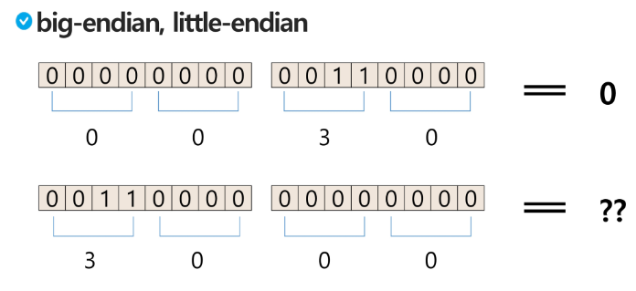

# APS 문자열
## 문자의 표현
* 글자 A를 메모리에 저장하는 방법
    * 메모리는 숫자만을 저장할 수 있기 때문에 A라는 글자의 모양 그대로 비트맵으로 저장하는 방법을 사용하지 않는 한 각 문자에 대해서 대응되는 숫자를 정해 놓고 이것을 메모리에 저장하는 방법이 사용됨.
* 영어가 대소문자 합쳐서 52이므로 6비트면 모두 표현할 수 있다.
* 1967년 ASCII(American Standard Code for Information Interchange)라는 문자 인코딩 표준을 제정
* ASCII는 7bit 인코딩으로 128문자를 표현하며 33개의 출력 불가능한 제어문자들과 공백을 비롯한 95개의 출력 가능한 문자들로 이루어짐(32~126)
## 확장 아스키
악센트 문자, 도형 문자, 특수 문자, 특수 기호 등 부가적인 문자를 128개 추가할 수 있게 하는 부호
* 표준 아스키는 7bit를 사용하여 문자를 표현하는데 확장 아스키는 1byte내의 8-bit를 모두 사용함으로써 추가적인 문자를 표현
* 컴퓨터 생산자와 소프트웨어 개발자가 여러가지 다양한 문자에 할당할 수 있음. 할당된 확장 부호는 표준아스키와 같이 서로 다른 프로그램이나 컴퓨터 사이에 교환되지 못함.
* 확장 아스키는 프로그램이나 컴퓨터 또는 프린터가 해독할 수 있도록 설계되어야 올바로 해독이 가능함

## 유니코드
각 나라에서 컴퓨터가 발전하면서 자국의 문자를 표현하기 위해 코드체계를 만들어서 사용하게 되면서 다국어 처리를 위해 만든 표준
* 유니코드도 다시 character set으로 분류
    * UCS-2(Universal Character Set 2)
    * UCS-4(Universal Character Set 4)
    * 유니코드를 저장하는 변수의 크기를 정의
    * 하지만 바이트의 순서에 대해 표준화하지 못했음.
     = 파일을 인식할 때 이 파일이 UCS-2, UCS-4인지 인식하고 각 경우를 구분해서 모두 다르게 구현해야 하는 문제 발생
    * 유니코드의 적당한 외부 인코딩이 필요

## big-endian, little-endian

- big endian : 낮은 주소에 데이터의 높은 바이트부터 저장하는 방식
메모리에 저장된 순서를 그대로 읽을 수 있고 이해하기 쉽다는 장점이 있다. (SPARC을 포함한 대부분의 RISC CPU계열에서는 이방식으로 데이터를 저장)

ex) 0x12345678라는 32비트 크기의 정수가 있으면 이 정수는 1바이트값 4개로 구성<br>
0x12, 0x34, 0x56, 0x78<br>
저장시 아래와 같음<br>


- little endian: 낮은 주소에 데이터의 낮은 바이트 부터 저장하는 방식, 읽을 때 거꾸로 읽어야함(인텔 CPU계열에서 사용)


파일 전송시 big-endian형태로 전송
데이터 조작, 연산시 little-endian으로 저장

## 유니코드 인코딩(UTF : Unicode Transformation Format)
* UTF-8(in web) # 뒤의 숫자는 최소길이
- Min : 8 bit, Max: 32 bit(1Byte *4)
* UTF-16(in windows, java)
- Min : 8 bit, Max: 32 bit(1Byte *4)
* UTF-32(in unix)
- Min : 8 bit, Max: 32 bit(1Byte *4)

'대'를 UTF-8로 인코딩하기<br>
대 = B300<br>
한글은 3byte사용하여서<br>
1100#### / 10###### / 10######로 표기<br>
1100 B(4) / 10 3(4)0(2) / 10 0(2)0(4)<br>
각 자리 (B,3,0,0)을 모두 4자리로 표기하는데 중간에 6자리 입력이어서 4자리로 3을 입력해주고 뒤에 두자리와 3번째 묶음의 앞의 두자리로 0을 표현해주어서 3byte를 표기<br>

## Python 인코딩
* 2.x 버전 - ASCII -> #-*- coding:utf-8 -*-(첫 줄에 명시)
* 3.x 버전 - 유니코드 UTF-8 -> 생략 가능
* 다른 인코딩 방식으로 처리시 첫줄에 작성하는 위 항목에 원하는 인코딩 방식을 지정해주면됨

# 문자열의 분류

## Java에서 string 클래스에 대한 메모리 배치 예시
아래 그림 처럼 java.lang.String 클래스에는 기본적인 객체 메타 데이터 외에도 네가지 필드들이 포함되어 있음(hash,문자열길이count,문자열 시작점offset, 문자열배열에 대한 참조 value)


## C언어에서 문자열 처리
* 문자열은 문자들의 배열 형태로 구현된 응용 자료형
* 문자 배열에 문자열을 저장할 때는 항상 마지막에 끝을 표시하는 널문자('\0')를 넣어줘야함
```c
char ary[]={'a','b','c','\0'};
```
## Java에서 문자열 처리
* 문자열 데이터를 저장, 처리해주는 클래스를 제공
* String클래스를 사용
```java
String str="abc";
```
* 문자열 처리에 필요한 연산을 연산자, 메소드 형태로 제공한다.
+, length(),replace(),split(),substring(),...

## Python에서 문자열 처리
* char 탑입 없음
* 텍스트 데이터의 취급방법이 통일되어 있음
* 문자열 기호
' '," ", 홑따옴표3개 ,쌍따옴표 3개<br>
* '+' 연결 <br>
* '*' 반복<br>
* 문자열은 시퀀스 자료형으로 분류(인덱싱, 슬라이싱 가능)
* 문자열은 튜플과 같이 요소값을 변경할 수 없음

## C와 Java의 string처리의 기본적인 차이점
* C는 아스키 코드로 저장한다.
* Java는 유니코드(UTF16,2Byte)로 저장한다.
* 파이썬은 유니코드(UTF8)로 저장
## 문자열 비교
* c strcmp()함수를 제공한다
* java에서는 equals()메소드를 제공한다.
    * 문자열 비교에서 == 연산은 메모리 참조가 같은지를 묻는 것
* 파이썬에서는 == 연산자와 is 연산자를 제공한다.
    * ==연산자는 내부적으로 특수 메서드 \_\_eq__()를 호출

## 문자열 숫자를 정수로 변환하기
* c언어에서는 atoi()함수를 제공한다. 역 함수로 itoa()가 있다.
* java에서는 숫자 클래스의 parse 메소드를 제공한다.
    * 예 : integer.parseInt(String)
    * 역함수로는 toString() 메소드를 제공한다.
* 파이썬에서는 숫자와 문자변환 함수를 제공한다.
str(123), int('123'), float('3.14'), repr(123)

