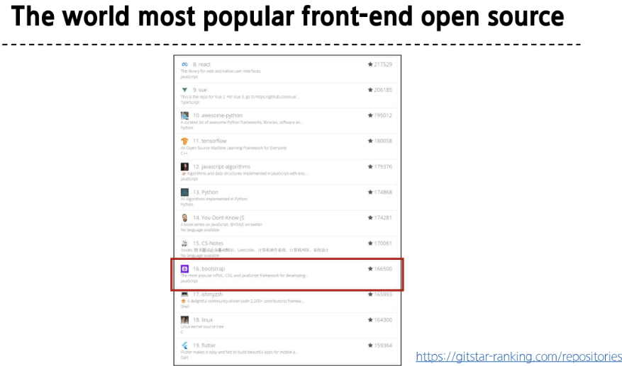
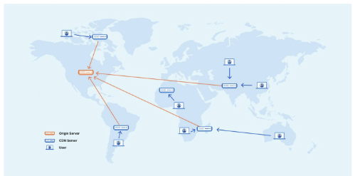

# Bootstrap
* CSS 프론트엔드 프레임워크(Toolkit)
* 미리 만들어진 다양한 디자인 요소들을 제공하여 웹사이트를 빠르고 쉽게 개발할 수 있도록 함
* Bootstrap은 가장 인기 많은 toolkit



## bootstrap 사용해보기
1. Bootstrap 공식 문서 접속(원문으로 접속할것 한글 문서는 업데이트가 늦고 빠진 내용이 많음)
-  http://getbootstrap.com/
2. Docs-> Introduction -> Quick Start
3. 'include Bootstrap's CSS and JS' 코드 확인 및 가져오기
- https://getbootstrap.com/docs/5.3/getting-started/introduction/#quick-start
- head와 body에 bootstrap CDN이 포함된 코드 블록

## CDN(Content Delivery Network)
* 지리적 제약 없이 빠르고 안전하게 콘텐츠를 전송할 수 있는 전송 기술
* 서버와 사용자 사이의 물리적인 거리를 줄여 콘텐츠 로딩에 소요되는 시간을 최소화(웹페이지 로드 속도를 높임)
* 지리적으로 사용자와 가까운 CDN서버에 콘텐츠를 저장해서 사용자에게 전달




## Bootstrap CDN
1. Bootstrap 홈페이지 docs - Download - 'Complied CSS and JS' 다운로드
2. CDN을 통해 가져오는 bootstrap css와 js파일을 확인
3. bootstrap.css 파일 참고
온라인 CDN 서버에 업로드 된 css 및 js 파일을 불러와서 사용하는 것

한개의 bootstrap 파일은 12000줄정도 되는데 이것은 각각 필요한 모듈들이 합쳐져서 만들어진 형태(필요한 부분만 골라서 사용도 가능함)


## Bootstrap 기본사용법


* Bootstrap에서는 클래스 이름으로 Spacing을 표현함


left right대신 start의 s , end의 e를 사용

rem= root em ==브라우저의 root px ==16px

https://getbootstrap.com/docs/5.3/utilities/spacing/#margin-and-padding

* Bootstrap에는 특정한 규칙이 있는 클래스 이름으로 스타일 및 레이아웃이 미리 작성되어 있음
* 모두 !important가 붙어 있어서 bootstrap의 규칙을 우선적용

# Reset CSS
Bootstrap 적용 전/후 비교


* Reset CSS
    * 모든 HTML요소 스타일을 일관된 기준으로 재설정하는 간결하고 압축된 규칙 세트
    > HTML Element,Table, List 등의 요소들에 일관성 있게 스타일을 적용시키는 기본 단계

## Reset CSS 사용 배경
* 모든 브라우저는 각자의 'user agent stylesheet'를 가지고 있음(font나 margin이 각각 다름)
    - 웹사이트를 보다 읽기 편하게 하기 위해
* 문제는 이설정이 브라우저마다 상이하다는 것
* 모든 브라우저에서 웹사이트를 동일하게 보이게 만들어야 하는 개발자에겐 매우 골치 아픈 일
> 모두 똑같은 스타일 상태로 만들고 스타일 개발을 시작하자!하여 초기화 시키고 다시 설정함

## User-agent stylesheets
* 모든 문서에 기본 스타일을 제공하는 기본 스타일 시트


## Normalize CSS
* Reset CSS 방법 중 대표적인 방법
* 웹 표준 기준으로 브라우저 중 하나가 불일치 한다면 차이가 있는 브라우저를 수정하는 방법
    - 경우에 따라 IE 또는 EDGE 브라우저는 표준에 따라 수정할 수 없는 경우도 있는데, 이 경우 IE 또는 EDGE의 스타일을 나머지 브라우저에 적용시킴

## Bootstrap에서의 Reset CSS
* Bootstrap은 bootstrap-reboot.css
라는 파일명으로 normalize.css를 자체적으로 커스텀해서 사용하고 있음


# Bootstrap 활용
## Typography
* 제목, 본문 텍스트, 목록 등

### Display headings
* 기존 Heading보다 더 눈에 띄는 제목이 필요한 경우(더 크고 약간 다른 스타일)


### Inline Text elements
HTML inline 요소에 대한 스타일


### Lists
HTML list 요소에 대한 스타일


## Colors
### Bootstrap Color system
Bootstrap이 지정하고 제공하는 색상 시스템

### Colors
Text,Border,Background 및 다양한 요소에 사용하는 Bootstrap의 색상 키워드


### Text Colors


### Background Colors


### Bootstrap 실습
너비와 높이가 각각 200px인 정사각형 작성하기(너비와 높이를 제외한 스타일은 모두 bootstrap으로 작성)


## Component
Bootstrap에서 제공하는 UI 관련 요소 (버트, 네비게이션 바, 카드, 폼, 드롭다운 등)

### 대표적인 Component
* Alerts
* Badges
* Buttons
* Cards
* Navbar

### Component 이점
일관된 디자인을 제공하여 웹사이트의 구성요소를 구축하는 데 유용하게 활용

## 참고
* Bootstrap 코드 파일을 불러와 사용하기

```html
<!-- 반드시 bootstrap 링크코드를 입력해야 동작함 -->
 <link href="https://cdn.jsdelivr.net/npm/bootstrap@5.3.0-alpha1/dist/css/bootstrap.min.css" rel="stylesheet"
    integrity="sha384-GLhlTQ8iRABdZLl6O3oVMWSktQOp6b7In1Zl3/Jr59b6EGGoI1aFkw7cmDA6j6gD" crossorigin="anonymous">
```

* Bootstrap을 사용하는 이유
- 가장 많이 사용되는 CSS 프레임워크
* 사전에 디자인된 다양한 컴포넌트 및 기능
    - 빠른 개발과 유지보수
* 손쉬운 반응형 웹 디자인 구현
* 커스터마이징(customizing)이 용이
* 크로스 브라우징(Cross browsing)지원
    - 모든 주요 브라우저에서 작동하도록 설계되어 있음

* Crousel (이미지가 회전하는 버튼)
```html
<!DOCTYPE html>
<html lang="en">

<head>
  <meta charset="UTF-8">
  <meta name="viewport" content="width=device-width, initial-scale=1.0">
  <link href="https://cdn.jsdelivr.net/npm/bootstrap@5.3.0-alpha1/dist/css/bootstrap.min.css" rel="stylesheet"
    integrity="sha384-GLhlTQ8iRABdZLl6O3oVMWSktQOp6b7In1Zl3/Jr59b6EGGoI1aFkw7cmDA6j6gD" crossorigin="anonymous">
</head>

<body>
  <!-- carousel의 id 값과 각 버튼의 data-bs-target이 일치 하는지를 잘 봐야 한다. -->
  <!--  model id 값과 버튼의  -->
  <div class="container">
    <div id="carouselExample" class="carousel slide">
      <div class="carousel-inner">
        <div class="carousel-item active">
          
        </div>
        <div class="carousel-item">
          
        </div>
        <div class="carousel-item">
          
        </div>
      </div>
      <button class="carousel-control-prev" type="button" data-bs-target="#carouselExample" data-bs-slide="prev">
        <span class="carousel-control-prev-icon" aria-hidden="true"></span>
        <span class="visually-hidden">Previous</span>
      </button>
      <button class="carousel-control-next" type="button" data-bs-target="#carouselExample" data-bs-slide="next">
        <span class="carousel-control-next-icon" aria-hidden="true"></span>
        <span class="visually-hidden">Next</span>
      </button>
    </div>
    <hr>
    <div id="carouselExample2" class="carousel slide">
      <div class="carousel-inner">
        <div class="carousel-item active">
          
        </div>
        <div class="carousel-item">
          
        </div>
        <div class="carousel-item">
          
        </div>
      </div>
      <button class="carousel-control-prev" type="button" data-bs-target="#carouselExample2" data-bs-slide="prev">
        <span class="carousel-control-prev-icon" aria-hidden="true"></span>
        <span class="visually-hidden">Previous</span>
      </button>
      <button class="carousel-control-next" type="button" data-bs-target="#carouselExample2" data-bs-slide="next">
        <span class="carousel-control-next-icon" aria-hidden="true"></span>
        <span class="visually-hidden">Next</span>
      </button>
    </div>
  </div>

  <script src="https://cdn.jsdelivr.net/npm/bootstrap@5.3.0-alpha1/dist/js/bootstrap.bundle.min.js"
    integrity="sha384-w76AqPfDkMBDXo30jS1Sgez6pr3x5MlQ1ZAGC+nuZB+EYdgRZgiwxhTBTkF7CXvN"
    crossorigin="anonymous"></script>
</body>

</html>

```

* modal
```html
  <!DOCTYPE html>
<html lang="en">

<head>
  <meta charset="UTF-8">
  <meta name="viewport" content="width=device-width, initial-scale=1.0">
  <link href="https://cdn.jsdelivr.net/npm/bootstrap@5.3.0-alpha1/dist/css/bootstrap.min.css" rel="stylesheet"
    integrity="sha384-GLhlTQ8iRABdZLl6O3oVMWSktQOp6b7In1Zl3/Jr59b6EGGoI1aFkw7cmDA6j6gD" crossorigin="anonymous">
</head>

<body>
  <!-- modal id 값과 버튼의  data-bs-target이 각각 올바르게 일치하는지 확인 -->
  <!-- 주의사항 -->
  <!-- 1. modal 코드와 button 코드가 반드시 함께 다닐 필요는 없다. -->
  <!-- 2. modal 코드가 다른 코드 안쪽에 중첩되어 들어가버리면 modal이 켜졌을때 회색 화면 뒤로 감춰질 수 있음 -->
  <!-- 3. modal 코드는 주로 body 태그가 닫히는 곳에 모아두는 것을 권장 -->

  <!-- Button trigger modal -->
  <button type="button" class="btn btn-primary" data-bs-toggle="modal" data-bs-target="#exampleModal">
    Launch demo modal
  </button>

  <hr>

  <!-- Button trigger modal -->
  <button type="button" class="btn btn-primary" data-bs-toggle="modal" data-bs-target="#exampleModal2">
    Launch demo modal
  </button>

  <!-- Modal -->
  <div class="modal fade" id="exampleModal2" tabindex="-1" aria-labelledby="exampleModalLabel" aria-hidden="true">
    <div class="modal-dialog">
      <div class="modal-content">
        <div class="modal-header">
          <h1 class="modal-title fs-5" id="exampleModalLabel">Modal title</h1>
          <button type="button" class="btn-close" data-bs-dismiss="modal" aria-label="Close"></button>
        </div>
        <div class="modal-body">
          2번 모달
        </div>
        <div class="modal-footer">
          <button type="button" class="btn btn-secondary" data-bs-dismiss="modal">Close</button>
          <button type="button" class="btn btn-primary">Save changes</button>
        </div>
      </div>
    </div>
  </div>


  <!-- Modal -->
  <div class="modal fade" id="exampleModal" tabindex="-1" aria-labelledby="exampleModalLabel" aria-hidden="true">
    <div class="modal-dialog">
      <div class="modal-content">
        <div class="modal-header">
          <h1 class="modal-title fs-5" id="exampleModalLabel">Modal title</h1>
          <button type="button" class="btn-close" data-bs-dismiss="modal" aria-label="Close"></button>
        </div>
        <div class="modal-body">
          1번 모달
        </div>
        <div class="modal-footer">
          <button type="button" class="btn btn-secondary" data-bs-dismiss="modal">Close</button>
          <button type="button" class="btn btn-primary">Save changes</button>
        </div>
      </div>
    </div>
  </div>


  <script src="https://cdn.jsdelivr.net/npm/bootstrap@5.3.0-alpha1/dist/js/bootstrap.bundle.min.js"
    integrity="sha384-w76AqPfDkMBDXo30jS1Sgez6pr3x5MlQ1ZAGC+nuZB+EYdgRZgiwxhTBTkF7CXvN"
    crossorigin="anonymous"></script>
</body>

</html>

```

# Semantic Web
* 웹 데이터를 의미론적으로 구조화된 형태로 표현하는 방식


google에서 Naver라고 검색할 경우,아래와 같이 검색결과가 나오는데 링크만 나오지 않고 웹사이트 내에 들어 있는 목록이 나오는 이유는 google이 자체적으로 semantic web을 검사하여 heading영역을 보여주기 때문 = 이것을 검색엔진 최적화(SEO)라고 함

=마케팅에서도 중요한 역할을 수행


## Semantic in HTML
* HTML 요소가 의미를 가진다는 것


### HTML Semantic Element
* 기본적인 모양과 기능 이외에 의미를 가지는 HTML 요소
* 검색엔진 및 개발자가 웹페이지 콘텐츠를 이해하기 쉽도록

* 대표적인 Semantic Element
    * header
    * nav
    * main
    * article
    * section
    * aside
    * footer

* Semantic Element 사용예시


## Semantic in CSS
### CSS 방법론
* CSS를 효율적이고 유지 보수가 용이하게 작성하기 위한 일련의 가이드라인
### OOCSS(Object Oriented CSS)
* 객체 지향적 접근법을 적용하여 CSS를 구성하는 방법론
* 기본원칙 : 기능별로 분리!(bootstrap에서 잘 나눠져있음)
* OOCSS 기본원칙
1. 구조와 스킨을 분리
- 구조와 스킨을 분리함으로써 재사용 가능성을 높임
- 모든 버튼의 공통 구조를 정의 + 각각의 스킨(배경색과 폰트 색상)을 정의


2. 컨테이너와 콘텐츠를 분리
- 객체에 직접 적용하는 대신 객체를 둘러싸는 컨테이너에 스타일을 적용
- 스타일을 정의할 떄 위치에 의존적인 스타일을 사용하지 않도록 함
- 콘텐츠를 다른 컨테이너로 이동시키거나 재배치할 때 스타일이 깨지는 것을 방지

### OOCSS 적용 예시


## 참고
- HTML : 콘텐츠의 구조와 의미
- CSS : 레이아웃과 디자인

* 의미론적인 마크업이 필요한 이유
    * 검색 엔진 최적화(SEO)
        - 검색엔진이 해당 웹사이트를 분석하기 쉽게 만들어 검색 순위에 영향을 줌
    * 웹접근성(Web Accessibility)
        - 웹 사이트, 도구, 기술이 고령자나 장애를 가진 사용자들이 사용할 수 있도록 설계 및 개발하는 것
        - ex) 스크린 리더를 통해 전맹 시각장애 사용자에게 웹의 글씨를 읽어줌
        - https://nuli.navercorp.com/

* OOCSS 코드 예시

```html
<!DOCTYPE html>
<html lang="en">

<head>
  <meta charset="UTF-8">
  <meta name="viewport" content="width=device-width, initial-scale=1.0">
  <title>Document</title>
  <style>
    /* 기본 Card 구조 */
    .card {
      border: 1px solid #ccc;
      border-radius: 4px;
      padding: 16px;
      width: 50%;
    }

    /* Card 제목 */
    .card-title {
      font-size: 20px;
      font-weight: bold;
      margin-bottom: 8px;
    }

    /* Card 설명 */
    .card-description {
      font-size: 16px;
      margin-bottom: 16px;
    }

    /* 기본 버튼 구조 */
    .btn {
      display: inline-block;
      border-radius: 4px;
      padding: 8px 16px;
      font-size: 1rem;
      font-weight: 400;
      color: #212529;
      text-align: center;
      text-decoration: none;
      cursor: pointer;
    }

    /* 파란 배경 버튼 */
    .btn-blue {
      background-color: #007bff;
      color: #fff;
    }

    /* 빨간 배경 버튼 */
    .btn-red {
      background-color: #cb2323;
      color: #fff;
    }
  </style>
</head>

<body>
  <div class="card">
    <p class="card-title">Card Title</p>
    <p class="card-description">This is a card description.</p>
    <button class="btn btn-blue">Learn More</button>
    <button class="btn btn-red">Learn More</button>
  </div>
</body>

</html>


```