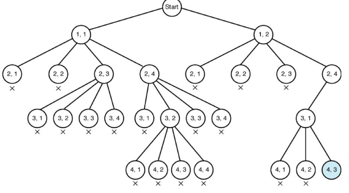

# 스택의 응용
## 계산기1
* 문자열로 된 계산식이 주어질 때, 스택을 이용하여 이 계산식의 값을 계산할 수 있다.
* 문자열 수식 계산의 일반적 방법
    1. 중위표기법의 수식을 후위 표기법으로 변경(스택 이용)
    > 중위 표기법(infix notation)<br>
    \- 연산자를 피연자의 가운데 표기하는 방법(A+B)<br>
    후위표기법(postfix notation)<br>
    \- 연산자를 피연산자 뒤에 표기하는 방법(AB+)
    2. 후위 표기법의 수식을 스택을 이용하여 계산

### 중위표기식의 후위표기식 변환 방법1
* 수식의 각 연산자에 대해서 우선순위에 따라 괄호를 사용하여 다시 표현
* 각 연산자를 그에 대응하는 오른쪽 괄호의 뒤로 이동
* 괄호 제거
    - A*B-C/D 변경
    1. ((A*B)-(C/D))
    2. ((A B)* (C D)/)-
    3. AB*CD/-

### 중위표기식의 후위표기식 변환 방법2
연산자를 스택에 넣음
1. 입력받은 중위 표기식에서 문자를 확인
2. 문자가 피연산자이면 문자를 출력
3. 문자가 연산자(괄호포함)일 때, 이 문자가 스택의 top에 저장되어 있는 연산자보다 우선순위가 높으면 스택에 push, 아니면 스택의 top의 연산자 우선순위가 문자의 우선순위보다 작을때까지 스택에서 pop한 후 문자의 연산자를 push
(이때 top에 연산자가 없으면 push)
4. 문자가 오른쪽 괄호 ')'이면 스택 top에 왼쪽 괄호 '('가 올 때까지 스택에 pop연산을 수행하고 pop한 연산자를 출력, 왼쪽괄호를 만나면 pop만하고 미출력
5. 중위 표기식에 더 읽을 것이 없다면 중지, 있으면 1부터 다시반복
6. 스택에 남아있는 연산자를 모두 pop하여 출력
- 스택 밖의 왼쪽 괄호는 우선순위가 가장 높지만, 스택 안의 왼쪽 괄호는 우선순위가 가장 낮다.


### 후위 표기법의 수식을 스택을 이용하여 계산
숫자를 스택에 넣어서 수행
1. 피연산자를 만나면 스택에 push
2. 연산자를 만나면 필요한 만큼의 피연산자를 스택에서 pop하여 연산하고, 연산결과를 다시 스택에 push
3. 수식이 끝나면,마지막으로 스택에 pop하여 출력(스택에 숫자가 하나만 남게 됨)


```py
top =-1
stack = [0]*100
icp ={'(':3,'*':2,'/':2,'+':1,'-':1} # 스택 밖에서의 우선순위
isp = {'(':0,'*':2,'/':2,'+':1,'-':1} # 스택 안에서의 우선순위

fx = '(6+5*(2-8)/2)'
postfix = ''

for tk in fx:
    # 여는 괄호면 push, 연산자이고 top 원소보다 우선순위가 높으면 push
    if tk== '(' or (tk in '*/+-' and isp[stack[top]]<icp[tk]):
        top +=1
        stack[top]=tk
    elif tk in '*/+-' and isp[stack[top]] >= icp[tk]:# 연산자이고 top원소보다 우선순위가 높지 않으면
        while isp[stack[top]]>=icp[tk]: #top원소의 우선순위가 낮을때까지 pop
            top -=1
            postfix +=stack[top+1]
        top +=1
        stack[top]=tk #push
    elif tk ==')': # 닫는 괄호면, 여는 괄호를 만날때까지 pop
        while stack[top] !='(':
            top -=1
            postfix += stack[top+1]
        top -=1 # 여는 괄호를 pop 해서 버림
    else:
        postfix += tk
print(postfix)

```


# 백트래킹(Backtracking)
* 백트래킹기법은 해를 찾는도중 '막히면' 되돌아가서 다시 해를 찾아가는 기법
* 백트래킹 기법은 최적화 문제와 결정 문제를 해결가능
* 결정문제란?
    * 문제의 조건을 만족하는 해가 존재하는지 여부를 답하는 문제
        * 미로찾기
        * n-Queen 문제
        * Map coloring
        * 부분 집합의 합(Subset Sum)문제 등
## 미로 찾기
* 스택을 이용하여 지나온 경로를 저장하고 역으로 돌아가는데 사용


## 백트래킹과 깊이우선탐색과의 차이
- 큰 차이점은 목적에 있음
    * 백트래킹은 하나의 정답을 찾기위해
    * DFS는 모든 노드를 방문하기 위해<br>
    =코드 상에서 유사함 그래서 DFS에서 조건(가능성이 없는 것을 배제)을 추가하게 되면 백트래킹형식이 됨
* 어떤 노드에서 출발하는 경로가 해결책으로 이어질 것 같지 않으면 더 이상 그 경로를 따라가지 않음으로써 시도의 횟수를 줄임(Pruning 가지치기)
* 깊이우선탐색이 모든 경로를 추적하는데 비해 백트래킹은 불필요한 경로를 조기에 차단.
* 백트래킹 알고리즘을 적용하면 DFS에 비해 경우의 수가 줄어들지만 최악의 경우 여전히 지수함수 시간을 요하므로 처리하기가 어려운 경우가 있음

## 백트래킹 기법
* 어떤 노드의 유망성을 점검한 후에 유망하지 않다고 결정되면 그 노드의 부모로 되돌아가 다음 자식 노드로 감
* 어떤 노드를 방문하였을 때 그노드를 포함한 경로가 해답이 될수 없으면 그 노드는 유망하지 않다고 하며, 반대로 해답의 가능성이 있으면 유망하다 판단
* 가지치기(Pruning) : 유망하지 않는 노드가 포함되는 경로는 더이상 고려하지 않음
## 백트래킹 알고리즘
1. 상태 공간 트리의 깊이우선검색 실시
2. 각 노드가 유망한지 점검
3. 유망하지 않으면 그 노드의 부모 노드로 돌아가서 검색을 계속한다.
```
def checknode(v): # node
    if promising(v):
        if there is a solution at v:
            write the solution
        else:
            for u in each child of v:
                checknode(u)    
```
ex) n-Queen
>n개의 queen을 체스판 n*n에 놓을 수 있는가?
```py

```

### 상태공간트리


## 부분집합
* 어떤 집합의 모든 부분집합을 powerset이라 함.
* 어떤 원소개수가 n개인 집합의 부분집합개수는 2**n개
### 백트래킹 기법으로 powerset 만들기
* 각원소가 부분집합에 포함되었는지를 loop를 통해 확인하고 부분집합 생성
```py
bit=[0,0,0,0]
for i in range(2):
    bit[0]=i
    for j in range(2):
        bit[1]=j
        for k in range(2):
            bit[2]=k
            for l in range(2):
                bit[3]=l
                print(bit)

```
```py
def backtrack(a,k,input):
    global Maxcandidates
    c= [0] * Maxcandidates

    if k ==input:
        process_solution(a,k)#답이면 원하는 작업을 한다.
    else:
        k+=1
        ncandidates = construct_candidates(a,k,input,c)
        for i in range(ncandidates):
            a[k] = c[i]
            backtrack(a,k,input)
def construct_candidates(a,k,input,c):
    c[0]= True
    c[1] = False
    return 2
Maxcandidates = 2
Nmax =4
a= [0]*Nmax
backtrack(a,0,3)
```

### 순열 구하기
백트래킹의 부분집합과정과 매우 유사
```py
def backtrack(a,k,input):
    global Maxcandidates
    c= [0] * Maxcandidates

    if k ==input:
        for i in range(1,k+1):
            print(a[i],end=' ')
        print()
    else:
        k+=1
        ncandidates = construct_candidates(a,k,input,c)
        for i in range(ncandidates):
            a[k] = c[i]
            backtrack(a,k,input)
def construct_candidates(a,k,input,c):
    in_perm = [0]*Nmax

    for i in range(1,k):
        in_perm[a[i]]=1
    
    ncandidates=0
    for i in range(1,input_1):
        if in_perm[i]==0:
            c[ncandidates]=i
            ncandidates +=1
    return ncandidates
```