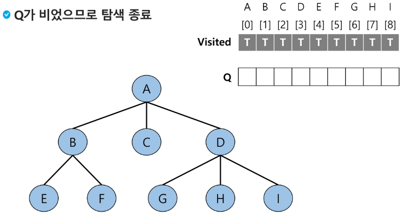
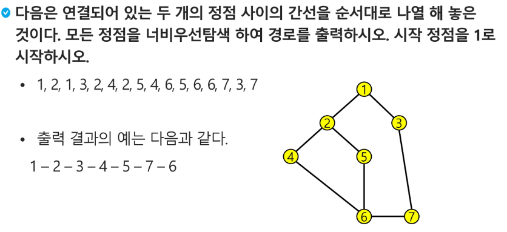

# BFS(Breadth First Search)
* 그래프를 탐색하는 방법 중 하나
* 너비우선탐색은 탐색 시작점의 인접한 정점들을 먼저 모두 차례로 방문한 후에, 방문했던 정점을 시작점으로 하여 다시 인접한 정점들을 차례로 방문하는 방식
* 인접한 정점들에 대해 탐색을 한 후, 차례로 다시 너비 우선탐색을 진행해야 하므로, 선입선출 형태의 자료구조인 큐를 활용함.


```py
def BFS(G,v): # 그래프 G와 탐색 시작점 v
    visited = [0]*(n+1) #n:정점의개수
    queue =[] # 큐생성
    queue.append(v) # 시작점 v를 큐에 삽입
    while queue: # 큐가 비어있지 않은 경우
        t= queue.pop(0) # 큐의 첫번째 원소 반환
        if not visited[t]: # 방문되지 않은 곳이라면
            visited[t]= True # 방문한 것으로 표시
            visit(t)
            for i in G[t]: # t와 연결된 모든 정점에 대해
                if not visited[i]: # 방문하지 않은 곳이라면
                    queue.append(i) # 큐에넣기

```




## BFS예제

1. A를 visited에 방문표시후 A를 enqueue
2. A에 인접한 B,C,D 를 enqueue
3. B를 dequeue하고 B에 인접한 E,F enqueue
4. C를 dequeue하고 인접이 없으므로 pass
5. D를 dequeue하고 D에 인접한 G,H,I enqueue
6. E를 dequeue하고 인접이 없으므로 pass
7. F를 dequeue하고 인접이 없으므로 pass
8. G를 dequeue하고 인접이 없으므로 pass
9. H를 dequeue하고 인접이 없으므로 pass
10. I를 dequeue하고 인접이 없으므로 pass

큐의 크기를 정해놓고 진행하기 위해 visited를 통해 방문했던 이력을 관리함. => 중복해서 queue에 들어가지 않아서 큐의 크기 관리하기가 편함

```py
def BFS(G,v,n): # 그래프 G, 탐색 시작점 v
    visited = [0]*(n+1)  # n: 정점의 개수
    queue = [] # 큐 생성
    queue.append(v) #시작점 v를 큐에 삽입
    visited[v]=1
    while queue: # 큐가 비어있지 않은 경우
        t= queue.pop(0) # 큐의 첫번째 원소 반환
        visit(t)
        for i in G[t]: # t와 연결된 모든 정점에 대해
            if not visited[i]: # 방문되지 않은 곳이라면
                queue.append(i) # 큐에넣기
                visited[i]=visited[t]+1 #n으로부터 1만큼 이동

```

BFS는 특정 지점까지의 최단거리 탐색을 할때 유용하게 사용가능



```py

def bfs(s,N): # 시작 정점s, 노드개수N
    q=[] # 큐
    visited =[0]*(N+1) # visited
    q.append(s) #시작점 인큐
    visited[s]=1 #시작점 방문표시
    while q:
        t=q.pop(0)
        # t에서 할일...
        print(t)
        for i in adjl[t]: #t에 인접인 정점
            if visited[i]==0: # 방문하지 않은 정점이면
                q.append(i) #인큐
                visited[i] =1 + visited[t] #방문표시

V,E = map(int,input().split())
arr = list(map(int,input().split()))
# 인접리스트
adjl=[[] for _ in range(V+1)]
for i in range(E):
    n1, n2 = arr[i*2], arr[i*2+1]
    adjl[n1].append(n2)
    adjl[n2].append(n1) # 무향그래프(양방향 이동)
bfs(1,V)
```

